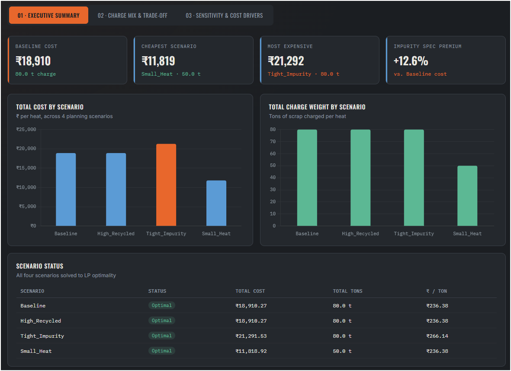
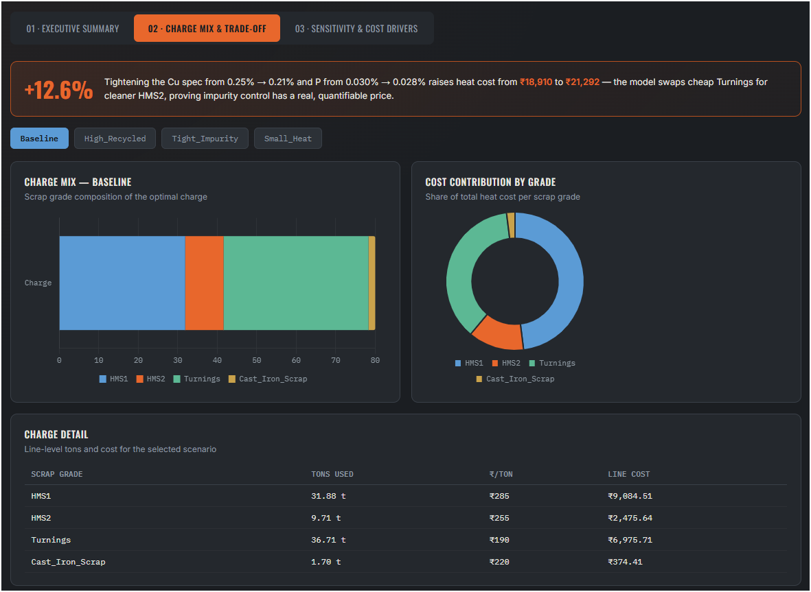
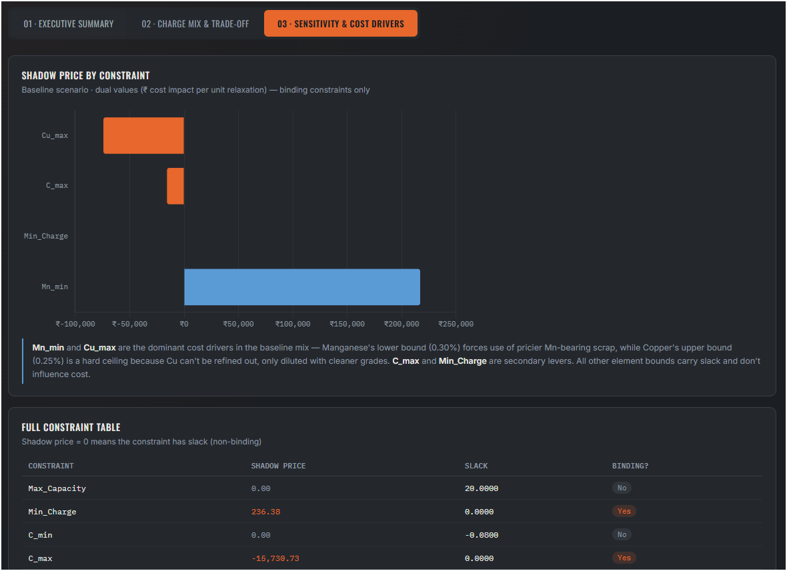

# Steel Charge & Scrap Mix Optimization

**Linear programming model to minimize scrap charge cost while meeting alloy composition, furnace capacity, and impurity constraints — built for core engineering / process optimization roles (GET tracks: Texas Instruments, Schneider Electric).**

---

## Problem Statement

Steel plants melt a mix of scrap grades (HMS1, HMS2, Turnings, Pig Iron, DRI, etc.) in an electric arc / induction furnace to hit a target alloy specification at the lowest possible cost. Each scrap grade differs in:

- **Cost per ton**
- **Composition** (Fe, C, Mn, Si, Cu, Cr, Ni, S, P)
- **Recovery rate** (yield loss during melting/oxidation)
- **Availability** (limited supply per grade)

The charge must simultaneously satisfy:
1. Target alloy composition (min/max % per element)
2. Furnace capacity (min/max charge weight per heat)
3. Impurity ceilings (tramp elements like Cu and P cannot be refined out — only diluted)

This is a textbook **linear programming (LP)** problem, solved here using Python's `PuLP` library with the CBC solver.

---

## Objective & Formulation

**Decision variables:** `x_i` = tons of scrap grade *i* charged

**Objective (minimize):**
```
Total Cost = Σ (cost_per_ton_i × x_i)
```

**Constraints:**
- Furnace capacity: `80 ≤ Σx_i ≤ 100` tons
- Composition bounds per element *e*:
  ```
  min_e ≤ Σ(x_i × comp_i,e × recovery_i) / Σx_i ≤ max_e
  ```
- Supply limits: `x_i ≤ availability_i`
- Non-negativity: `x_i ≥ 0`

---

## Tech Stack

| Layer | Tool |
|---|---|
| Optimization | Python, PuLP (CBC solver) |
| Data prep | Pandas, Excel |
| Dashboard | Power BI |
| Sensitivity analysis | LP dual values (shadow prices) via PuLP |

---

## Project Structure

```
steel-scrap-mix-optimization/
│
├── data/
│   ├── scrap_inventory.csv          # 10 scrap grades: cost, composition, availability, recovery rate
│   ├── target_spec.csv              # target alloy composition (min/max % per element)
│   ├── scenario_summary.csv         # cost/status/tons per scenario (model output)
│   ├── scenario_results_detail.csv  # charge mix breakdown per scenario (model output)
│   └── sensitivity_analysis.csv     # shadow prices & slack per constraint (model output)
│
├── src/
│   ├── optimize_charge_mix.py       # main LP model — 4 scenarios
│   └── sensitivity_analysis.py      # dual value / shadow price extraction
│
├── powerbi/
│   └── steel_charge_mix_dashboard.pbix
│
├── ss/
│   ├── page1_executive_summary.png
│   ├── page2_charge_mix_tradeoff.png
│   └── page3_sensitivity.png
│
└── docs/
    └── README.md
```

---

## Scenarios Modeled

| Scenario | Description |
|---|---|
| **Baseline** | Unconstrained cost minimization within spec |
| **High_Recycled** | Caps virgin inputs (Pig Iron + DRI) at 10% of charge — maximizes recycled content |
| **Tight_Impurity** | Simulates a higher-grade steel spec: Cu ≤ 0.21%, P ≤ 0.028% |
| **Small_Heat** | Smaller furnace batch (50–60 tons instead of 80–100) |

---

## Results

| Scenario | Status | Total Cost | Total Tons | ₹/Ton |
|---|---|---|---|---|
| Baseline | Optimal | ₹18,910.27 | 80.0 | ₹236.38 |
| High_Recycled | Optimal | ₹18,910.27 | 80.0 | ₹236.38 |
| Tight_Impurity | Optimal | ₹21,291.53 | 80.0 | ₹266.14 |
| Small_Heat | Optimal | ₹11,818.92 | 50.0 | ₹236.38 |

**Key finding:** Tightening the impurity spec (Cu, P) raises heat cost by **12.6%** — the model is forced to replace cheap, high-copper Turnings with cleaner (and pricier) HMS2, proving impurity control has a real, quantifiable cost in scrap procurement.

---

## Sensitivity Analysis (Shadow Prices)

LP dual values show which constraints actually drive cost — a standard technique in real steel plants for supplier negotiation and spec relaxation decisions.

| Constraint | Shadow Price (₹) | Interpretation |
|---|---|---|
| **Mn_min** | 217,125.28 | Dominant cost driver — Manganese floor (0.30%) forces use of pricier Mn-bearing scrap |
| **Cu_max** | −74,208.26 | Copper ceiling (0.25%) is a hard limit — Cu cannot be refined out, only diluted |
| **C_max** | −15,730.73 | Carbon ceiling limits use of cheap high-carbon scrap (Turnings) |
| **Min_Charge** | 236.38 | Minimum batch size constraint adds marginal cost per ton |
| All others | 0 | Non-binding — have slack, don't affect cost |

**Reading it:** a negative shadow price on an upper-bound constraint (e.g., Cu_max) means relaxing that limit by 0.01% would *reduce* cost by that amount — this is the exact number a plant would use when negotiating a slightly looser customer spec, or when deciding whether investing in impurity-removal refining is worth it.

---

## Dashboard

Three-page Power BI dashboard built on the scenario and sensitivity outputs:

### Page 1 — Executive Summary
KPI cards (Baseline Cost, Cheapest Scenario, Most Expensive, Impurity Spec Premium %), cost/tons comparison charts, and a scenario status table.



### Page 2 — Charge Mix & Trade-off
Scenario slicer, stacked charge-mix bar chart, cost-contribution donut, and line-level charge detail table. Includes the callout: **+12.6% cost for tighter impurity spec.**



### Page 3 — Sensitivity & Cost Drivers
Shadow price bar chart (binding constraints only) and full constraint table with slack values.



---

## How to Run

```bash
# Install dependencies
pip install pulp pandas openpyxl matplotlib

# Run the optimization (generates 4 scenarios)
cd src
python optimize_charge_mix.py

# Run sensitivity / shadow price analysis
python sensitivity_analysis.py
```

Outputs are written to `../data/` as CSVs, ready to import into Power BI.

---

## Relevance to Core Engineering / GET Roles

This project was built to demonstrate skills directly applicable to process/production engineering roles at manufacturing companies (Texas Instruments GET, Schneider Electric GET):

- **Operations research applied to manufacturing:** formulating a real production-planning problem (charge mix) as a constrained LP, not just a toy dataset
- **Cost-quality trade-off quantification:** translating an engineering spec change (impurity tolerance) into a hard ₹ cost number — the kind of analysis production planning and process engineers do for supplier and spec decisions
- **Sensitivity / duality analysis:** using shadow prices to identify true cost drivers, mirroring how real plants prioritize which constraints to renegotiate (with suppliers) or invest in relaxing (via refining/process changes)
- **End-to-end tooling:** Python for modeling, Power BI for decision-support — the same Python → BI handoff used in industrial data/process teams

---

## Author

**Ayush Verma** — B.Tech Mechanical Engineering, MANIT Bhopal (2027)
